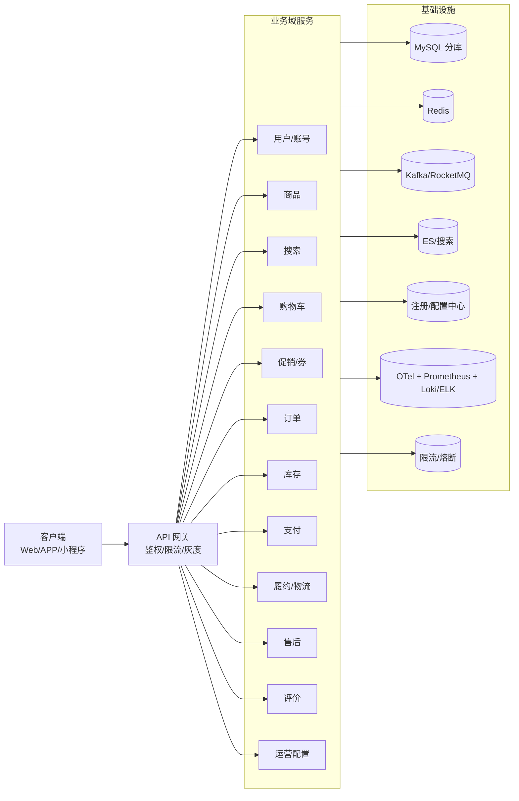
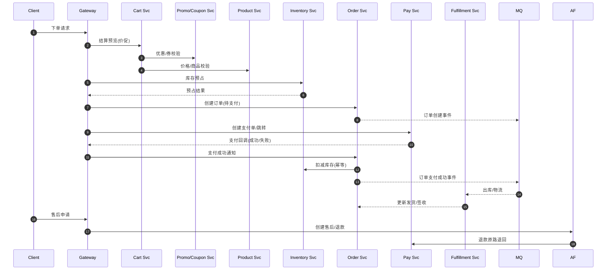
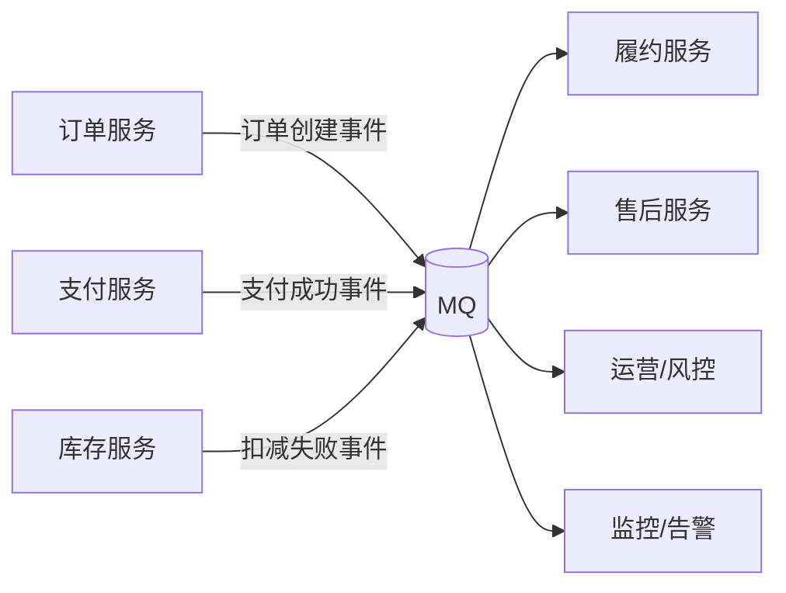
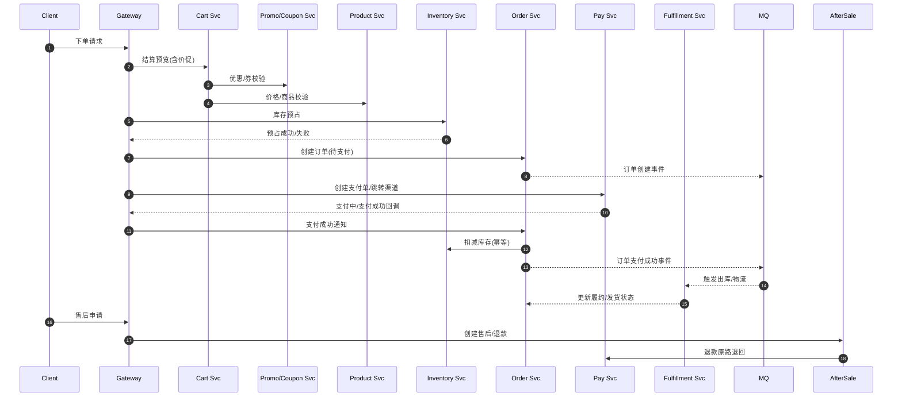

# 电商微服务技术方案（概览）

## 1. 技术栈与基础设施
- 语言/框架：Go 1.21+；Gin/Fiber + gRPC（gRPC-GW 对外 REST）；Buf/Proto 管理契约。
- 服务治理：注册/配置中心（Nacos/Consul + Apollo 可选）、限流/熔断（Sentinel-Go/自建）、灰度/金丝雀（网关+配置）。
- 数据：MySQL（按域分库：用户、商品、订单、库存、支付、促销、售后）、Redis（热点缓存/会话/幂等键/分布式锁）、ES（搜索/联想/榜单）。
- 消息：Kafka 或 RocketMQ（事件流、削峰、补偿）。
- 观测性：OpenTelemetry（trace/metric/log），Prometheus + Loki/ELK；告警与 SLO。
- 容器与发布：Docker + K8s；CI/CD（GitHub Actions/GitLab CI）+ Helm。

## 2. 可视化图示（便于飞书阅读）
### 2.1 分层/组件总览


### 2.2 核心链路时序（下单→支付→履约→售后）


### 2.3 防超卖与补偿流程
```mermaid
flowchart TD
    A[下单请求] --> B[库存预占<br/>写锁/乐观扣减]
    B -->|成功| C[创建订单(待支付)]
    B -->|失败| R1[返回库存不足]
    C --> D[支付进行中]
    D -->|支付成功回调| E[订单标记已支付]
    E --> F[扣减库存(幂等)]
    F -->|成功| G[发货流程]
    F -->|失败| R2[告警+补偿<br/>人工/自动重试]
    D -->|超时/用户取消| H[释放预占库存]
```

### 2.4 事件流示意


## 3. 服务拆分与职责
- 网关：统一入口、鉴权、路由、限流、灰度、签名校验；暴露 HTTP/REST，内网 gRPC。
- 用户/账号：注册登录、Token/Session、地址簿、账号安全。
- 商品：SPU/SKU、类目/属性、上下架、价格读取、媒体；与库存联动展示库存。
- 搜索：索引构建、检索、联想、纠错；与商品保持索引同步（CDC/事件）。
- 购物车：加购/变更/删除、跨端合并、价促试算（调用促销/商品）。
- 促销/券：满减/满折/直降/限时、券领取/核销/回滚、叠加优先级、限购策略。
- 订单：下单校验、价格重算、库存预占、订单创建、拆单（仓/商家预留）、状态机、超时取消、补单。
- 库存：库存查询、预占/解占/扣减、防超卖、锁粒度（仓-商品-SKU）、安全库存阈值。
- 支付：支付单、收银台聚合、支付回调校验、支付超时取消、对账、退款。
- 履约/物流：仓配分单、出库、运单绑定、轨迹同步、签收确认、异常处理。
- 售后：退货退款/仅退款/换货、举证、审核、逆向物流、退款原路退回。
- 评价：评价/追评/晒图、举报、敏感词/违规审核。
- 运营配置：运营位/公告、黑白名单/限购策略、活动配置。
- 平台基础：鉴权、配置/注册、消息、观测性、限流熔断、分布式事务（Outbox + TCC/Saga 按需）。

## 3. 核心链路时序（下单→支付→履约→售后）


## 4. 防超卖与一致性策略
- 模式：下单时库存预占（短暂锁定），支付成功后扣减；支付超时/取消解占。
- 幂等：预占/解占/扣减接口使用幂等等幂键（orderId + op type）。
- 一致性：订单、库存、支付使用 Outbox/本地消息表 + MQ；支付回调幂等处理；扣减失败需补偿/告警。
- 秒杀/热点：独立队列/令牌桶，热点隔离，快速失败，兜底库存缓存与降级页面。

## 5. 限流、熔断、降级
- 网关限流（IP/用户/路径/QPS），热点/秒杀独立限流。
- 服务侧熔断（下游超时/错误率），降级兜底（读兜底数据，写限流队列）。
- 预案：订单/支付成功率、库存扣减失败率、延迟告警；触发开关降级。

## 6. 观测性
- Trace：OpenTelemetry，全链路注入 trace-id，在日志中关联。
- Metrics：QPS/RT/错误率/成功率、库存扣减失败率、支付回调失败率、队列堆积。
- Log：结构化 JSON，脱敏；关键字段（trace-id、user-id、order-id）。
- 告警：核心指标阈值 + SLO（下单/支付成功率、P95/P99 时延）。

## 7. 数据与缓存分层
- 按域分库：用户、商品、订单、库存、支付、促销、售后。
- 缓存：商品/价格/库存热点、促销规则、会话/Token、幂等键；防穿透（布隆）、防击穿/雪崩（过期分布+预热）。
- 搜索索引：增量同步（CDC/事件）到 ES；商品上下架/价格变更驱动重建或局部更新。

## 8. 接口与事件（概念）
- 订单：`POST /orders/prepare`（校验+预占）`POST /orders` `GET /orders/{id}` `POST /orders/{id}/cancel`
- 支付：`POST /payments` `POST /payments/{id}/callbacks` `POST /payments/{id}/refund`
- 库存：`POST /inventory/reserve` `POST /inventory/release` `POST /inventory/commit`
- 促销/券：`POST /coupons/claim` `POST /coupons/validate`
- 售后：`POST /aftersales` `GET /aftersales/{id}`
- 事件（MQ）：订单创建、支付成功、库存扣减失败、订单超时取消、发货、签收、售后状态变更、券核销、积分变更。

## 9. 里程碑建议（最小闭环）
- M1：网关+用户+商品+购物车+下单预占+支付沙箱+扣减+履约记录；观测性基线。
- M2：促销/券、库存防超卖完善、支付对账/补单、订单超时取消。
- M3：履约/物流对接、售后/退款、评价、运营后台。
- M4：大促专项：秒杀隔离、灰度/限流/降级、压测与容量评估、告警预案。

