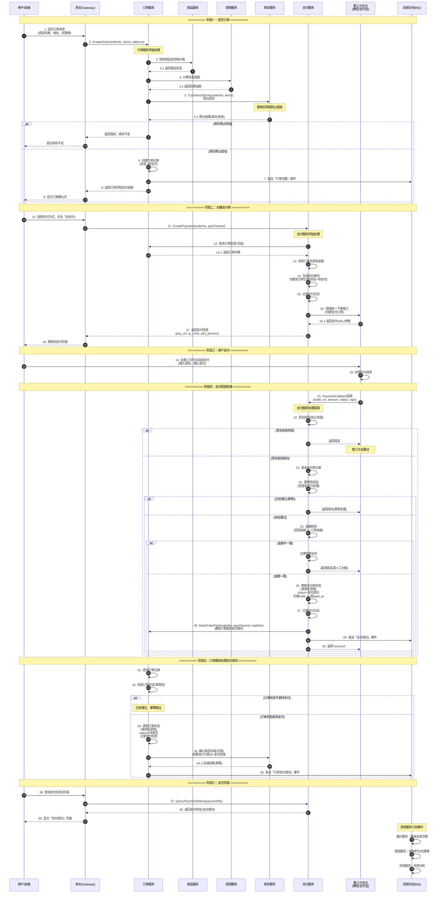
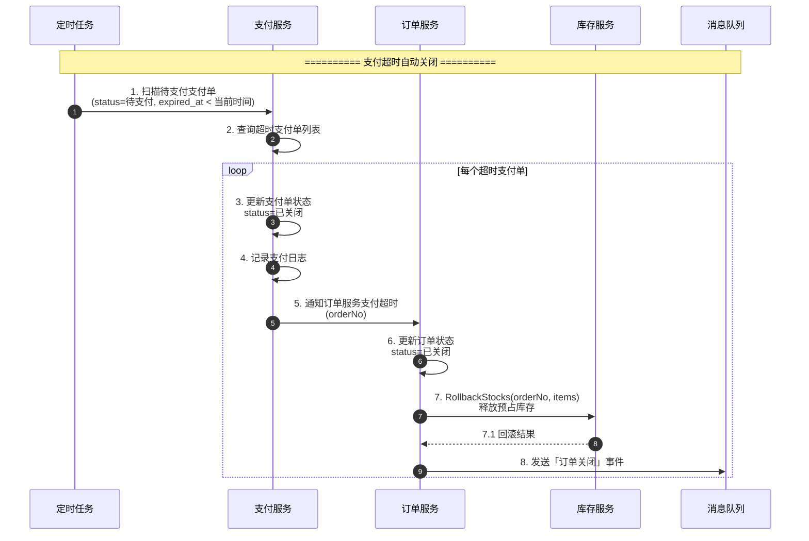
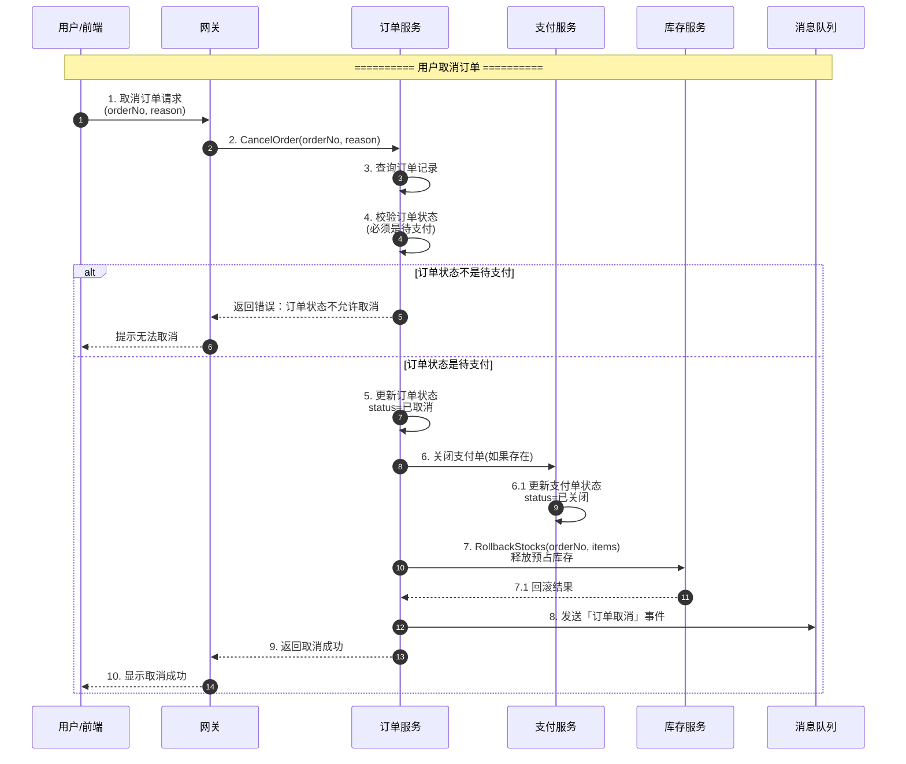

# 订单支付流程时序图

## 完整流程：从提交订单到支付完成

## 支付超时处理流程

## 用户主动取消订单流程

## 关键设计要点说明

### 1. 防超卖机制
- **下单时**：库存预占（短暂锁定，使用乐观锁）
- **支付成功**：确认扣减（如果设计为预占+支付扣减）
- **支付超时/取消**：释放预占库存

### 2. 幂等性保障
- **支付回调**：使用 `payment_no + status` 作为幂等键
- **库存操作**：使用 `order_no + sku_id + reason` 作为幂等键
- **订单状态更新**：使用乐观锁（version字段）

### 3. 安全性保障
- **签名校验**：所有支付回调必须校验签名
- **金额校验**：回调金额必须与订单金额一致
- **敏感信息**：加密存储（API密钥、私钥等）

### 4. 异常处理
- **支付超时**：定时任务自动扫描并关闭
- **回调丢失**：支持主动查询第三方支付状态
- **金额不一致**：记录告警日志，人工对账
- **服务异常**：重试机制、降级策略

### 5. 服务解耦
- **异步通信**：使用MQ发送事件，服务间解耦
- **同步通信**：关键流程使用gRPC同步调用
- **事件驱动**：便于扩展和监控
