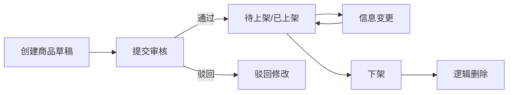
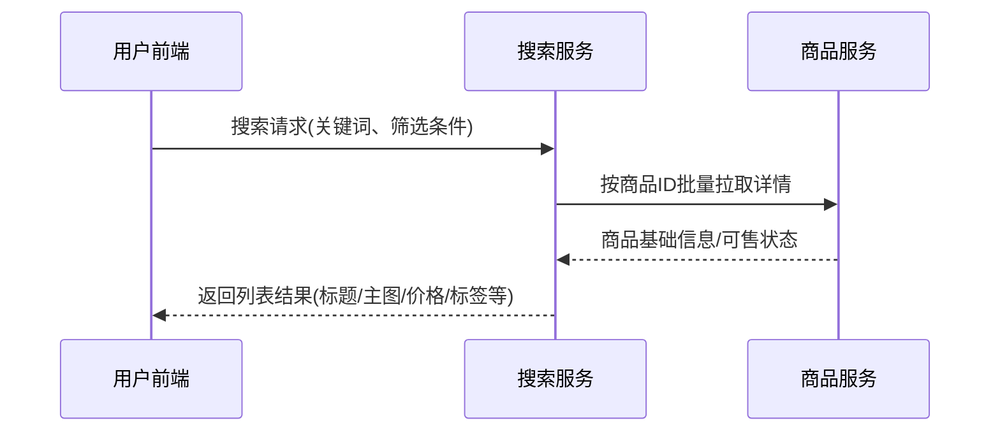
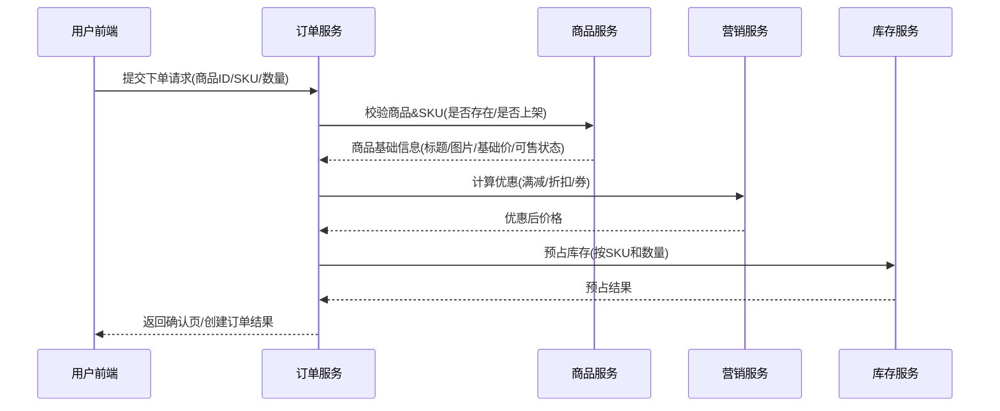

## 商品服务需求文档（PRD）

### 1. 背景与目标（产品视角）

- **背景**
  - 随着电商业务规模扩大，平台上的商品数量、品类、价格策略不断增加，原有分散在各业务系统中的商品信息存在数据冗余、同步不及时、维护困难等问题。
  - 目前商品相关能力（如商品信息、类目、品牌、属性、库存、价格）分别分布在多个系统中，缺乏统一的管理和服务出口，难以支撑多端多业务线的复用和扩展。
  - 需要一个统一的「商品中心」来承载商品主数据与相关业务能力，对外提供标准化的商品服务能力，为用户端、订单、库存、营销、推荐等系统提供统一的数据基座。

- **目标**
  - 搭建**独立的商品服务**，实现商品相关数据和业务逻辑的统一管理与对外服务。
  - 支持多类目、多品牌、多规格、多价格维度的商品管理，满足复杂电商业务需求。
  - 提供标准化 API，支撑前台（Web/小程序/App）、后台管理系统以及其他微服务（订单、库存、营销、搜索等）的集成与调用。
  - 支持未来业务扩展，例如多渠道、多语言、多站点、多租户等场景。

---

### 2. 角色与典型使用场景

#### 2.1 角色定义

- **平台运营（OP）**
  - 负责整个平台的类目体系、品牌库、商品规范、运营活动商品配置。
- **商家运营 / 供应商（MP，后续可扩展多商户时启用）**
  - 负责自家店铺商品的创建、维护与活动报名。
- **内容/审核团队（CS）**
  - 负责审核商品信息合规性（图片、文案、资质等）。
- **风控团队（RC）**
  - 负责风控规则配置与风险拦截策略。
- **前台用户（C 端）**
  - 浏览/搜索商品、查看详情、下单购买。
- **其他系统 / 服务**
  - 订单服务、库存服务、支付/营销/搜索/推荐等，用商品服务作为“商品事实来源”。

#### 2.2 核心用户故事

- **故事 1：运营配置类目与属性模板**
  - 作为平台运营，我可以在后台创建“手机数码 > 手机 > 智能手机”等多级类目，并为“智能手机”配置一套属性模板（品牌、型号、存储容量、颜色等），使得后续所有该类目下的商品在创建时都遵循统一规范。

- **故事 2：运营创建与上架一个普通商品**
  - 作为运营，我可以在商品后台选择一个类目 + 品牌，录入商品基础信息（标题、副标题、主图、详情等）、配置多个 SKU（不同颜色/容量），提交审核，通过后在设定时间自动上架，前台即可搜索和浏览到该商品。

- **故事 3：运营调整商品价格与上下架状态**
  - 作为运营，我可以在某个活动前对部分 SKU 的基础售价进行调整，并设定上架/下架时间，确保活动开始时商品自动上架，活动结束后商品自动下架或恢复原价（价格恢复逻辑由营销系统协同）。

- **故事 4：前台用户浏览与下单前校验**
  - 作为 C 端用户，我可以通过类目/搜索快速找到目标商品，浏览图文详情、规格参数与价格信息；在下单时，由订单服务调用商品服务确保该商品当前处于“可售状态”，且显示的价格等于实际结算价格基准。

- **故事 5：风控/审核团队拦截违规商品**
  - 作为审核人员，我会收到新商品/变更商品的审核任务，可以查看商品完整信息与资质，判断是否合规；若不合规，我可以驳回并填写原因，商品保持“驳回/草稿”状态，不会对外展示。

---

### 3. 业务范围与边界

**商品服务主要负责：**

1. **商品主数据管理**
   - 维护商品的核心信息（名称、副标题、描述、品牌、类目、主图、详情等）。
   - 管理商品的生命周期状态（草稿、待审核、已上架、已下架、已删除）。

2. **类目管理**
   - 支持多级类目结构（至少 3 级，支持扩展）。
   - 支持类目的增删改查、顺序调整、启停用。
   - 支持类目与属性模板关联，用于约束该类目下商品的属性结构。

3. **品牌管理**
   - 品牌信息的增删改查（名称、LOGO、国家、排序等）。
   - 支持品牌与类目的关联（一个品牌可对应多个类目）。

4. **属性与规格管理**
   - 属性模版管理（如「手机」类目的属性：颜色、存储容量、屏幕尺寸等）。
   - 区分销售属性（用于组合 SKU）与非销售属性（仅展示）。
   - 属性值的维护（如颜色值：黑、白、蓝等）。

5. **SPU/SKU 管理**
   - SPU（商品）：描述一类商品的公共信息（名称、类目、品牌、图文详情等）。
   - SKU（库存单元）：SPU 下的具体销售单元（如「黑色 128G」/「白色 256G」）。
   - 支持商品草稿、复制、编辑、批量导入导出。

6. **价格管理**
   - 商品/SKU 的标准售价、划线价、成本价等字段的维护。
   - 支持多价格维度扩展（如渠道价、会员价、多币种价格）——可作为后续迭代。

7. **库存信息对接（基础信息）**
   - 维护 SKU 与库存服务的映射关系（SPU/SKU 编码、单位、体积、重量等）。
   - 商品服务不直接负责库存数量的增减，但需支持查询当前可售库存（数据来源于库存服务）。

8. **上下架与可售控制**
   - 支持手动上/下架。
   - 支持设置定时上架/下架。
   - 支持按渠道控制可售状态（如仅支持线上、不支持线下）。

9. **商品展示信息管理**
   - 标题、副标题、卖点文案、图文详情、参数规格、包装清单等。
   - 支持多语言、多终端（如 PC、H5、App）展示模板的配置（可作为后续扩展）。

10. **商品标签与分组**
    - 支持为商品打标签（新品、爆款、清仓、限量等）。
    - 支持创建商品分组（如「推荐专区」「新品专区」）用于前台展示。

11. **审核与风控支持**
    - 商品创建/修改后需触发审核流程（人工审核或自动规则审核）。
    - 支持审核结果记录：通过、驳回、驳回原因、操作人、时间等。
    - 支持与风控系统联动，对包含敏感词、违规信息的商品进行拦截或标记。

12. **统计与报表支撑**
    - 商品维度基础数据输出，支持 BI/报表系统拉取（如商品上架数量、下架数量、各类目商品数、品牌覆盖度等）。
    - 不直接负责交易/销售数据统计，但需支持关联订单服务获取相关统计数据。

13. **跨系统集成**
    - 提供标准化 API：商品查询、批量查询、类目/品牌/属性查询等。
    - 支持与搜索服务对接（商品上下架时推送索引变更事件）。
    - 支持与订单服务、库存服务、营销服务、推荐服务等进行数据交互。

**不在本期范围内（后续可扩展）：**

- 内容（UGC/PGC）与社区化内容管理（如买家秀、UGC 评价内容富文本管理）。
- 复杂的商品定价规则（如阶梯价、区域价）——本期仅做基础字段预留。
- 供应链/进销存管理（由库存/采购/供应链服务承担）。

---

### 4. 业务流程说明（详细）

#### 4.1 商品全生命周期流程

**文字说明：**

1. **商品创建**
   - 运营或商家在后台/供应商平台发起新商品创建。
   - 填写必填字段：商品名称、类目、品牌、主图、关键属性、售卖价格等。
   - 创建后默认进入「草稿」状态。

2. **商品审核**
   - 草稿提交审核后，进入「待审核」状态。
   - 审核人员在后台查看商品信息（含图文、属性、资质等），进行审核：
     - 通过：商品状态变为「已上架」或「待上架」（依据设置）。
     - 驳回：商品状态变为「驳回」，记录驳回原因，通知商品创建人。

3. **商品上架**
   - 支持以下几种上架方式：
     - 立即上架：审核通过后立即上架。
     - 定时上架：配置生效时间，到点自动上架。
   - 上架时需满足前置条件：
     - 商品信息完整（关键属性、主图、价格等）。
     - 至少一个 SKU 有可售库存（由库存服务提供/校验）。

4. **商品下架**
   - 支持人工立即下架（运营/商家操作）。
   - 支持定时下架（如活动结束自动下架）。
   - 下架后商品不再对用户展示和售卖，但保留商品数据用于订单、报表等。

5. **商品变更**
   - 商品信息变更（如标题、详情、图片、价格、属性）需记录变更日志。
   - 重要信息变更（如价格、类目、品牌）可配置是否需要重新审核。
   - 变更后需通知相关系统（搜索、推荐、缓存刷新等）。

6. **商品删除（逻辑删除）**
   - 对不再使用的商品支持逻辑删除操作，标记为「已删除」。
   - 已删除商品不再对前台展示，但历史订单中的商品信息仍可查询。

**全生命周期流程图（示意）：**



#### 4.2 商品创建/编辑详细流程（SPU & SKU）

**目标**：规范一个商品从“无到有”的操作步骤，避免信息缺失与错配。

1. **选择类目与品牌**
   - 必须优先选择三级类目（或末级类目），以加载对应属性模板。
   - 品牌列表根据类目过滤（类目-品牌有绑定关系）。

2. **填写 SPU 基础信息**
   - 标题（必填，控制字数与敏感词）
   - 副标题/卖点（选填，用于列表页展示）
   - 主图（必填，1 张）与轮播图（1~9 张）
   - 商品详情（富文本 + 图片），支持图文混排
   - 包装清单、售后服务描述等基础文案

3. **填写属性信息**
   - 根据类目加载属性模板，区分：
     - 必填属性：如品牌、型号、适用人群等，未填写不能提交。
     - 销售属性：如颜色、容量、尺码，用于生成 SKU 组合。
     - 展示属性：如材质、尺寸、保质期，用于详情页展示。
   - 属性录入类型：单选、多选、自由文本、数值区间等。

4. **配置 SKU 组合**
   - 根据销售属性自动生成 SKU 组合矩阵（如颜色 × 尺码）。
   - 对每个 SKU 配置：
     - SKU 名称（可自动拼接颜色+尺码）
     - 条码/货号（可手动或导入）
     - 销售价、划线价、成本价
     - 所属图片（如展示不同颜色主图）
     - 重量、体积（供运费与库存使用）
   - 支持批量编辑价格/库存等字段。

5. **草稿保存与多次编辑**
   - 任一阶段可将当前商品状态保存为“草稿”，允许后续继续补充信息。

6. **提交审核**
   - 商品必须满足必填项全部填写、至少一个 SKU 配置完整后，方可提交审核。

7. **审核通过后等待上架**
   - 审核通过后，商品进入“待上架”或“已上架”状态，具体取决于是否设置“立即上架”或“定时上架”。

**商品创建/编辑流程图：**

```mermaid
flowchart LR
  A[选择类目&品牌] --> B[填写SPU基础信息]
  B --> C[填写属性(销售+展示)]
  C --> D[配置SKU组合及价格]
  D --> E[保存草稿]
  E -->|补充/修改| B
  D --> F[提交审核]
  F --> G[待审核]
```

#### 4.3 类目与属性管理流程

1. **类目管理**
   - 运营在后台可以创建、修改、删除类目。
   - 类目支持多级结构（如 3~4 级）。
   - 类目之间不可形成循环引用。

2. **属性与属性值配置**
   - 针对每个类目配置属性模版：
     - 属性：名称、类型（文本/枚举/数值/布尔等）、是否必填、是否为销售属性。
     - 属性值：可选值列表（如颜色：红、蓝、黑）。
   - 商品创建时，根据所属类目自动加载对应属性模版，提示必填项。

#### 4.4 品牌管理流程

1. **品牌录入**
   - 添加品牌：录入品牌名称、LOGO、国家、官网链接等。
   - 绑定类目：配置品牌适用的一级/二级/三级类目。

2. **品牌维护**
   - 支持品牌信息修改（名称、LOGO 更换）。
   - 支持品牌启用/停用状态控制。

#### 4.5 商品搜索与筛选（与搜索服务协同）

1. **前台商品列表**
   - 用户在前台通过类目、关键字、品牌、价格区间、属性值进行筛选。
   - 商品服务需支持根据条件进行查询，返回商品基础信息和排序字段（价格、销量、上新时间等）。

2. **搜索引擎同步**
   - 商品上/下架、信息变更时，商品服务通过事件推送给搜索服务，用于更新搜索索引。

**搜索与列表展示时序示意：**



#### 4.6 与其他核心业务的交互

1. **与订单服务**
   - 下单前校验商品是否可售、是否有有效 SKU。
   - 在订单创建/支付前再拉取商品最新价格、标题、图文信息进行二次校验。

2. **与库存服务**
   - 商品服务提供 SKU 维度的静态信息（规格、体积、重量等），供库存服务使用。
   - 商品服务可从库存服务查询当前可售库存，用于前台展示「剩余库存」或决定是否可购买。

3. **与营销服务**
   - 商品服务提供基础价与类目信息，供营销系统计算促销价格、满减门槛等。
   - 支持为商品配置营销相关属性或标签（如参与活动标记）。

4. **与风控/内容安全**
   - 商品新增/修改时，触发内容安全审核（如标题、描述、图片是否违规）。
   - 对于风险商品，可标记为「审核不通过」「需整改」，并通知相关人员。

**下单前商品校验与库存联动时序示意：**



---

### 5. 功能需求列表（带验收要点）

#### 5.1 类目管理

- 新增类目
  - 支持多级结构配置（如最多 3~4 级）。
  - 配置类目名称、排序、图标、是否展示、父级类目。
- 修改类目
  - 支持名称、排序、展示状态、父子关系调整。
- 删除类目
  - 限制：若类目下存在商品/子类目，则需先迁移或禁用，避免直接删除造成数据不一致。
- 查询类目
  - 支持按层级、名称关键字、状态进行查询。
  - 返回结构化的树形数据，便于前端展示。

#### 5.2 品牌管理

- 新增品牌：录入名称、LOGO、描述、所属国家、首字母等。
- 编辑品牌信息。
- 删除/停用品牌（需校验是否已绑定商品）。
- 按名称、拼音首字母、类目筛选品牌列表。

#### 5.3 商品（SPU）管理

- 新增 SPU（创建商品）
  - 选择所属类目、品牌。
  - 录入基础信息：名称、副标题、卖点、图文详情、包装清单等。
  - 配置商品主图、轮播图、视频、附件等。
  - 选择并填写属性：根据类目加载属性模版，区分必填与非必填。
  - 配置 SPU 级别设置：售后服务说明、发货时效、运费模板、发货地等。
  - 设置商品标签（新品、爆款等）。
  - 创建后保存为「草稿」，可多次编辑。

- 编辑 SPU 信息
  - 支持修改名称、图片、详情、属性等。
  - 对关键字段变更时，需根据配置决定是否进入审核流程。

- SPU 列表与查询
  - 支持按类目、品牌、状态、关键词、创建时间、上架状态等维度查询。
  - 支持分页、排序、多条件组合筛选。

- 商品状态管理
  - 支持将 SPU 从草稿变为待审核/已上架/已下架。
  - 支持批量上架/下架。
  - 支持逻辑删除 SPU（需确保与订单/库存无冲突）。

#### 5.4 SKU 管理

- 新增/编辑 SKU
  - 基于 SPU 的销售属性组合生成 SKU（如颜色+尺码）。
  - 为每个 SKU 配置：SKU 编码、条形码、销售价格、划线价、成本价、重量、体积、图片等。
  - 支持同一 SPU 下多个 SKU。

- SKU 列表与查询
  - 按 SPU、SKU 编码、属性值组合进行检索。
  - 支持导出 SKU 列表用于线下处理。

#### 5.5 上下架与渠道控制

- 手动上/下架
  - 在商品详情页/列表页中，运营或商家可点击按钮执行上架/下架。
- 定时上/下架
  - 在商品配置中设置上架时间和下架时间，到点自动生效。
- 渠道维度控制
  - 配置商品在哪些渠道可见/可售（如 PC、H5、App、店铺小程序等）。

#### 5.6 商品查询/检索能力（对内对外）

- 对前台/其他服务提供的查询能力：
  - 根据商品 ID/SKU ID 批量查询商品基础信息。
  - 根据类目/品牌/关键字/属性过滤条件获取商品列表。
  - 获取指定 SPU 的所有 SKU 信息。
  - 获取商品的基础信息（标题、主图、价格、标签、属性、可售状态等）。

#### 5.7 审核与日志记录

- 商品审核记录
  - 每次审核操作（通过/驳回）记录审核人、时间、原因。
- 操作日志
  - 记录商品从创建、编辑、审核、上下架、删除等所有关键操作，用于审计与问题追溯。

#### 5.8 权限与安全要求

- **权限控制**
  - 后台操作需基于角色权限控制（如「商品运营」「类目管理员」「品牌管理员」）。
  - 细分权限：仅允许部分角色进行上架、删除、审核等关键操作。

- **数据安全与合规**
  - 对商品中的敏感字段（如供应价）进行权限控制，不对普通用户/非授权角色暴露。
  - 商品图片、文案内容支持对接内容安全扫描，违规信息禁止上架。

#### 4.9 性能与可用性要求（从业务视角）

- 商品详情页接口：
  - 正常情况下 P95 响应时间 < 200ms，P99 < 500ms。
- 商品列表/搜索场景：
  - 单次查询支持返回上千级别的数据量（分页形式），保证体验流畅。
- 支撑日均数十万级别商品条目、上亿级别 SKU 存量数据。
- 高峰期请求可自动扩缩容，保证核心接口可用性 ≥ 99.9%。

---

### 5. 里程碑规划（示例）

> 实际里程碑可根据公司战略和资源情况调整。

1. **M1：商品中心基础版**
   - 支持类目、品牌、商品（SPU）、SKU 的基础增删改查。
   - 支持商品上下架、基础查询接口。
   - 支持与订单服务、库存服务的基础集成（商品信息查询、SKU 基本信息同步）。

2. **M2：运营与搜索联动**
   - 支持商品标签、分组配置。
   - 商品变化事件推送至搜索服务，完成索引同步。
   - 支持前台多条件查询（类目/品牌/属性/价格等）。

3. **M3：高级特性与优化**
   - 支持多价格维度配置（渠道价、会员价）及导出/导入。
   - 商品审核流程与内容安全接入。
   - 增加商品数据统计接口，支持 BI 报表集成。

---

以上为「商品服务」的业务需求文档（PRD）示例，全部为业务层面需求说明，不涉及具体技术实现细节。后续可在此基础上与产品、运营、技术团队进一步细化和评审。


